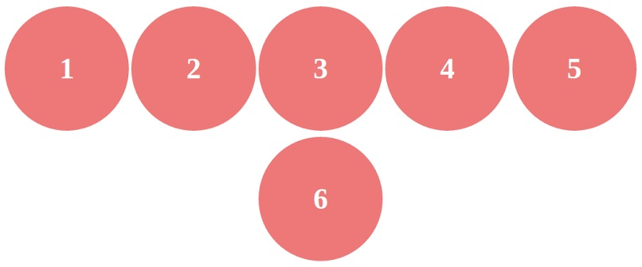

# RWD &ndash; zadania

## Zadanie 1. Viewport
Ustaw viewport dla Twojej strony tak, aby zawsze był taki jak szerokość urządzenia, a domyślne powiększenie miało wartość **1**.
Napisz w komentarzu swoje spostrzeżenia.
Zmień wartość atrybutu **content** na `width=500`, a następnie na `width=100`.
Napisz w komentarzu swoje spostrzeżenia, co się zmieniło?

## Zadanie 2. Zapytania media queries
Ustaw media queries zgodnie z poniższą tabelą.

| Wielkość ekranu w pikselach | Kolor tła |
| :---: | :---: |
| do 400 | zielony |
| od 400 do 800 | fioletowy |
| ponad 800 | pomarańczowy |


## Zadanie 3. Układ elementów
Stwórz dwa boksy w HTML-u. W pliku Sassa ustaw je obok siebie oraz ustaw im szerokość i wysokość na **400px** oraz kolor i lewy margines na **10px**.	Za pomocą media queries spraw, aby na ekranach mniejszych niż **640px** elementy spadły pod siebie i aby ich szerokość była ustawiona na **100%**.

## Zadanie 4. Strona w układzie grid
Przygotuj prostą stronę w oparciu na układzie kolumnowym, odwzoruj poniższy obraz. Przygotują stronę tak, aby szerokość elementów można było określić poprzez nadanie im **klasy** określającej liczbę kolumn. Sam zaprojektuj grid.


Za pomocą media queries zmień swój grid, tak aby na ekranie smartfona główne elementy układu strony wyświetlały się jeden pod drugim, a nie obok siebie. Jeśli urządzenie jest w orientacji poziomej, to kolumny nadal mają być wyświetlane obok siebie.

## Zadanie 5. Mixin, mobile first
Ustaw wielkość fontu dla swojego projektu (dla nagłówków, paragrafów itp). Zapisz wielkości do zmiennych w Sassie. Zapisz również do zmiennych breakpoints dla telefonu i tabletu. Następnie napisz mixin,	który w zależności od urządzenia powiększy font o **2px**. Użyj podejścia mobile first.

## Zadanie 6. Flexbox
Za pomocą flexboksa wykonaj następujące polecenia:
* ustaw cztery dowolne elementy obok siebie (stwórz je w pliku **index.html**), a następnie wyrównaj je do prawej strony,
* ustaw elementy listy o **klasie** ```lista``` na środku strony.

## Zadanie 7. Flexbox &ndash; layout
Przygotuj układ strony "The Holy Grail". Użyj flexboksa.

## Zadanie 8. Flexbox &ndash; elementy
Użyj flexboksa do następującego ustawienia sześciu kółek:



Kółka przy mniejszej szerokości ekranu powinny automatycznie spadać pod siebie. Przykład wyżej pokazuje, że jedno kółko się nie mieści w viewporcie i dlatego spada w dół. Stwórz mixin dla prefiksów flexboksa.

## Zadanie 9. Flexbox &ndash; kolejność elementów
Użyj flexboksa do odwzorowania następującego layoutu:


Następnie dodaj breakpointy które usprawią że na telefonie (do 420px) widok będzie taki:


Zwróć uwagę na kolejność elementów w wersji na telefon.


## Zadanie 10. Warunkowe wykonanie skryptu
Utwórz na swojej stronie sekcję nawigacyjną z odnośnikami. Spraw, by nie była domyślnie wyświetlana na ekranie smartfona.
Gdy sekcja nawigacyjna jest ukryta, ma być widoczny element z treścią menu, który po kliknięciu pokazuje i ukrywa nawigację.
Możliwa jest sytuacja, w której użytkownik małego ekranu przy widocznym menu rozszerza przeglądarkę. Wtedy menu powinno zniknąć i pokazać się lista z menu.
Pamiętaj, aby skrypt był wykonywany, tylko gdy użytkownik odwiedza stronę na smartfonie.

## Zadanie 11. Wstawianie obrazów
Na swoją stronę wstaw obrazy następująco:
* przez tag **img**,
* jako tło elementu **div**.

Zrób to w taki sposób, aby na ekranie komputera stacjonarnego obrazy wyświetlały się obok siebie i każdy z nich miał **50%** szerokości ekranu, a na ekranie tabletu jeden pod drugim (przy **100%** szerokości ekranu).
Wykorzystaj zdobytą wiedzę i ustaw style tak, aby oba obraz skalowały się przy zmniejszaniu okna przeglądarki.
