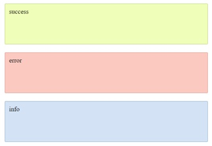

#Sass

##Zakładamy, że masz już zainstalowane Ruby oraz Sass.

1. **Tworzenie projektu**

	* Stwórz w swoim edytorze nowy projekt o dowolnej nazwie z plikiem index.html. 
	* Dodaj w nim nagłówek z tekstem, np. nagłówek „Hello, Sassy!” i otwórz go w przeglądarce.
	* Następnie, utwórz katalog o nazwie css, a w nim plik style.scss.  W pliku określ kolor dla nagłówka oraz kolor tła całej strony. Najlepiej tak, aby nagłówek był czytelny. 
	* W pliku index.html wczytaj **wygenerowany arkusz styli z odpowiednim rozszerzeniem.** Odśwież stronę w przeglądarce, by zobaczyć, czy zmiany zostały skompilowane.
	* Zmień teraz kolor nagłówka w pliku Sass i sprawdź jeszcze raz.

2. **Sprawdź mapowanie kodu źródłowego**

	Za pomocą narzędzi deweloperskich dostępnych w Twojej przeglądarce sprawdź nazwę pliku źródłowego oraz wiersz, w którym została zdefiniowana wartość koloru nagłówka.
 
3. **Nadpisywanie zmian**

	Bezpośrednio w wygenerowanym pliku CSS zmień kolor nagłówka i wprowadź dodatkową właściwość, np. margines. Sprawdź zmiany w przeglądarce. Przejdź do pliku SCSS i wprowadź dowolną zmianę inną od tej wprowadzonej w pliku CSS, np. padding. Zapisz plik i sprawdź rezultat w wynikowym pliku CSS i przeglądarce. Co się zmieniło? 

4. **Komentarze**

	Dodaj dwa rodzaje komentarzy ("//"" oraz "/*  */") do pliku scss i sprawdź, które są kompilowane do css, a które nie.

5. **Użyj zmiennej do określenia koloru**

	Dodaj w pliku index.html listę przynajmniej trzech możliwości Sass. Kolor tekstu listy powinien być taki sam jak nagłówka. Użyj do tego jednej zmiennej.

6. **Selektor rodzica &**

	Ustaw na elementach listy z poprzedniego zadania, pseudo-klasę hover i ustaw w niej kolor tekstu na czerwony. Dla pierwszego elementu listy ustaw kolor pomarańczowy.

7. **Selektor rodzica & - jeszcze raz** :smile:

	Utwórz toolbar z nawigacją, tak by jej elementy wyświetlały się obok siebie i były wyrównane do lewej. Po najechaniu kursorem powinien zmienić się ich kolor lub tło. Toolbar powinien powinien mieć klasę .nav-toolbar, a odnośniki klasę .nav-item. Spraw też aby ostatni element był wyrównany do prawej.

8. **Zastąp prefiksy przeglądarek używając mixin**

	Dodaj do elementów listy zaokrąglone obramowanie używając „vendor prefixes” (-webkit, -moz). Napisz i wykorzystaj do tego mixin z argumentem, którym będzie wielkość zaokrąglenia. Pamiętaj o odpowiednim zagnieżdżeniu elementów. 
	Sprawdź czy border-radius potrzebuje jeszcze prefixów [Can I use - border-radius](http://caniuse.com/#search=border-radius)

9. **Zorganizuj pliki Sass-owe według schematu poniżej**: (jeśli nie potrzebujesz, któregoś z plików bądź katalogów nie twórz go):

	Przeglądarka powinna wysłać tylko jedno zapytanie do serwera dotyczące plików CSS.


10. **Logika i interpolacja**

	Za pomocą pętli określ kolor obramowania dla 10 kontenerów. Niech kolor będzie pomarańczowy dla parzystych kontenerów, a niebieski dla nieparzystych.

	Przykład:

	```<div class="block_1"><div>```

	```<div class="block_2"><div>```

	```<div class="block_3"><div>```

	```<div class="block_4"><div>```

11. **Placeholder**

	Stwórz 3 boksy, które reprezentują: sukces, error i info. 

	

	Ostyluj je za pomocą Sass. Spróbuj wykorzystać w tym zadaniu placeholder, aby nie generować dodatkowej reguły w css. Niech Twój kod HTML wygląda w następujący sposób:

	```<div class="success"> succes </div>```

	```<div class="error"> error </div>```

	```<div class="info"> info </div>```

12. **Mapy**

	Stwórz mapę z 5 wybranymi kolorami. Wykorzystaj ją, aby ustawić kolor tła dla zadania z okienkami (success, error, info).


13. **Operacje matematyczne i na kolorach, funkcje**

	Wstaw na stronie kilka nagłówków, np. od ```<h1>``` do ```<h4>```. Zapisz za pomocą zmiennej wysokość linii i podstawowy rozmiar tekstu, a następnie zastosuj dla całego dokumentu.

	Dla rozmiaru nagłówków zastosuj skalę modularną na podstawie zdefiniowanego rozmiaru tekstu z mnożnikiem 1,3 pamiętając o ich hierarchii (h1 powinien być największy). Pamiętaj o nadaniu dla każdego nagłówka odpowiedniej wysokości linii, tak, aby była wielokrotnością tej zdefiniowanej dla całego dokumentu.

	Ustaw kolory nagłówków tak by każdy kolejny był jaśniejszy od poprzedniego o 15%.
	
	Użyj funkcji do obliczania rozmiaru nagłówka.

14. **Media queries**

	Napisz mixin, który pozwoli na zmianę układu wcześniej stworzonej nawigacji, tak by na ekranach mniejszych niż 500 pikseli odnośniki wyświetlały się jeden pod drugim.

	Zapisz 500px jako zmienną tak, aby można było ją łatwo dopasować do innych ekranów lub utworzyć nowe punkty graniczne, jeśli zajdzie taka potrzeba.

	Pamiętaj przy tym o komentarzach dla innych developerów, którzy mogą w przyszłości pracować z Twoim kodem. Dla optymalizacji, wstawiaj komentarze dotyczące SASS w taki sposób żeby nie były widoczne w wynikowym pliku CSS.


